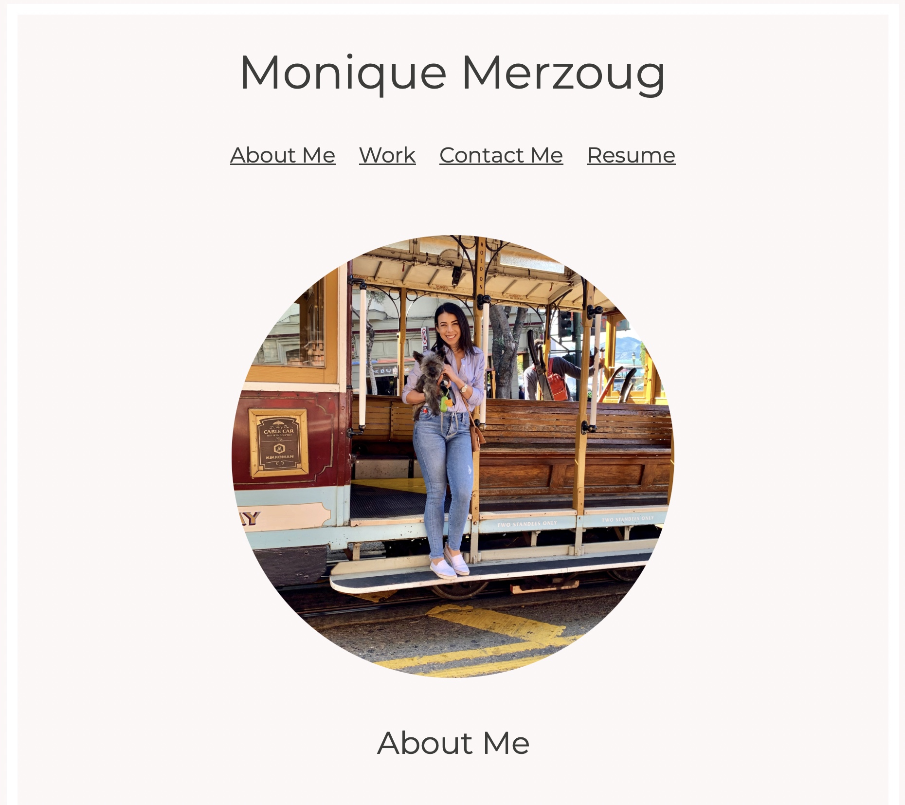

# Monique Merzoug React Portfolio

[](https://opensource.org/licenses/MIT)


### Table of Contents
1. [Description](#description)
2. [Installation](#installation)
3. [Technologies](#technologies) 
4. [Usage](#usage)
5. [Images](#images)
6. [Contributing](#contributing)
7. [Collaborators](#collaborators)
8. [Tests](#tests)
9. [Questions](#questions)
10. [License](#license)
11. [Project URL](#project-url)
12. [Video Walkthrough](#video-walkthrough)


### Description
This portfolio website showcases Monique Merzoug's skills and projects as a recent UC Berkeley Extension Coding Boot Camp graduate. The site is built using React and links the viewer to various projects she built that display her range of front-end and back-end development skills, such as HTML, CSS, JavaScript, jQuery, responsive design, React, APIs, Node, Express, MySQL, Sequelize, MongoDB, Mongoose, REST, and GraphQL.

The site includes a Portfolio section that contains a range of projects completed by or contributed to by Monique, as well as an About section that provides more information about her background and skills. Additionally there is a Contact and Resume section for more information about how to contact her and to view her resume. The site is fully responsive and can be viewed on a variety of devices, including desktop, tablet, and mobile.


### Technologies
This project utilizes the following technologies:

Front-end
- React
- React DOM
- React Router DOM
- Bootstrap
- Font Awesome

Back-end
- EmailJS
- Development tools
- Vite
- ESLint


### Installation
To install this project, follow these steps:
1. Clone the repository:

    ``` git clone https://github.com/MMerzoug/React-Portfolio.git```

2. Navigate to the project directory:

    ``` cd React-Portfolio```

3. Install the dependencies:

    ``` npm install```

4. Start the development server:

    ``` npm run dev```

If you are still having trouble, you can search for help online or ask for help from a more experienced developer.

### Usage
To use this portfolio website, simply navigate to the website in your web browser. You will be presented with a homepage that showcases some of my best work. You can click on the links to learn more about each project, or view my resume to learn more about my experience and skills.

You can also use the navigation bar at the top of the page to navigate to different sections of the website. The Portfolio section contains all of my projects, the About section contains information about me and my skills, the Contact section contains information on how to contact me, and the Resume section contains my resume.


### Images




### Contributing
Contributions to this project are currently not being accepted. If you would like to contribute, please contact me at the email listed below.


### Collaborators
This project was completed with guidance and assistance from EdX/UC Berkeley Extension tutor, Jose Lopez. If any code may have been referenced to complete this assignment is was sourced from EdX curriculum content.

### Tests
There are currently no tests for this project.

### Questions
If you have any questions, please contact me:

- GitHub: [MMerzoug](https://github.com/MMerzoug)
- Email: Monique.Merzoug1@gmail.com


### License
This project is licensed under the [MIT License](https://opensource.org/licenses/MIT).

### GitHub Repository
https://github.com/MMerzoug/React-Portfolio.git

### Project URL
https://monique-merzoug-portfolio.netlify.app
